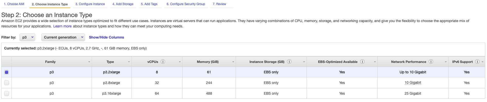

# Spark3 GPU Setup and Applications with Nvidia Rapidsai on AWS EC2

### These instructions are prepared for "Introduction to Deep Learning with Apache Spark" lectures given by Prof. Dr. Altan Çakır in "DeepLearn 2022 Spring - 5th International School on Deep Learning" <a href="#these-instructions-are-prepared-for-introduction-to-deep-learning-with-apache-spark-lectures-given-b" id="these-instructions-are-prepared-for-introduction-to-deep-learning-with-apache-spark-lectures-given-b"></a>

## Step 1 - Launch an EC2 Instance on AWS

* [x] Select Deep Learning AMI while you are in eu-west-2 region.

.png>)


* [x] Choose p3.2xlarge instance type and click Next.




* [x] 1 - Click "Configure Security Group" on the navigation bar.&#x20;
* [x] 2 - Choose "All Traffic" in the rule section then click "Review and Launch".&#x20;

.png>)


* [x] Now you can Launch your instance with your key-pair. If you need further information about launching EC2 instance, please visit [https://aws.amazon.com/ec2/getting-started/](https://aws.amazon.com/ec2/getting-started/)

## &#x20;Step 2 - Setup Spark3 on EC2

First, connect to your EC2 instance which we launched in the previous step.

* [x] Change the owner of the /opt directory then go to /opt.

```
sudo chown -R ubuntu:ubuntu /opt
cd /opt
```

* [x] Download Spark3 and extract the files. (We will use 3.2.1 version. If the link does not work, find a proper download link from [https://spark.apache.org](https://spark.apache.org))

```
wget https://dlcdn.apache.org/spark/spark-3.2.1/spark-3.2.1-bin-hadoop3.2.tgz

tar -xvf spark-3.2.1-bin-hadoop3.2.tgz

#You can remove the tgz file after extracting the files.
rm spark-3.2.1-bin-hadoop3.2.tgz
```

* [x] Add Spark Home into bashrc file.

```
#Step1 - Open bashrc file of your user.
nano ~/.bashrc

#Step2 - Add the following lines and save the file.

#SPARK3
export SPARK_HOME=/opt/spark-3.2.1-bin-hadoop3.2
export PYSPARK_PYTHON=/usr/bin/python3

#Step3 - Source bashrc.
source ~/.bashrc
```

* [x] Add some GPU configurations into the config file of Spark.

```
#Step1 - Go to Spark config directory.
cd ${SPARK_HOME}/conf

#Step2 - Create sh file from the template.
cp spark-defaults.conf.template spark-defaults.conf

#Step3 - Open the file.
nano spark-defaults.conf

#Step4 - Add the following lines and save the file.

spark.worker.resource.gpu.amount  1
spark.worker.resource.gpu.discoveryScript /opt/spark-3.2.1-bin-hadoop3.2/examples/src/main/scripts/getGpusResources$

```

* [x] Start Spark Master and Spark Worker.

```
$SPARK_HOME/sbin/start-master.sh
$SPARK_HOME/sbin/start-slave.sh spark://$HOSTNAME:7077
```

## Step 3 - Download Necessary Jar Files

Cuda, Rapid, and XGboost drivers are necessary to be able to execute the GPU applications whşch we will see in the next steps.

* [x] Create an application directory.

```
mkdir /opt/xgboost
```

* [x] Download Jar Files in the application directory.

```
#Go to the application directory.
cd /opt/xgboost

#CUDA
wget https://repo1.maven.org/maven2/ai/rapids/cudf/22.02.0/cudf-22.02.0-cuda11.jar

#RAPIDS
wget https://repo1.maven.org/maven2/com/nvidia/rapids-4-spark_2.12/22.02.0/rapids-4-spark_2.12-22.02.0.jar

#XGBOOST
wget https://repo1.maven.org/maven2/com/nvidia/xgboost4j_3.0/1.4.2-0.2.0/xgboost4j_3.0-1.4.2-0.2.0.jar

wget https://repo1.maven.org/maven2/com/nvidia/xgboost4j-spark_3.0/1.4.2-0.2.0/xgboost4j-spark_3.0-1.4.2-0.2.0.jar
```

## Congratulations!

It's all set. You are good to go for GPU based XGboost applications :)

####

### Reference Repository:

[https://github.com/NVIDIA/spark-rapids-examples](https://github.com/NVIDIA/spark-rapids-examples)
